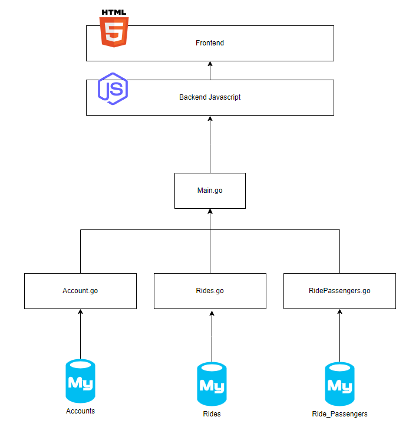

# Car Poola

## Design Considerations

### Microservices Overview
This project comprises three microservices:
- **Accounts Service:** Manages user accounts and authentication.
- **Rides Service:** Handles ride creation, management, and retrieval.
- **Ride Passengers Service:** Manages the relationship between rides and passengers.

### Design Principles
- **Separation of Concerns:** Each microservice handles their own specific functionalities to maintain modularity and scalability.
- **Database Normalization:** Utilizes normalized tables for efficient data storage and retrieval.
- **Error Handling:** Implements error handling when through status codes when a REST operation fails.
- **Source file bundling** Used webpack bundler to package src files

## Architecture Diagram

## Instructions for Setup
- Create the respective tables: rides, accounts and ride_passengers
- Run the main.go file to start up all three microservices
- Open the index.html to show the webpage

### Prerequisites
- Go language
- MySQL database
- Moesif CORS

### Src Files
- **account.js** For account REST operations
- **ride.js** For ride REST operations
- **ridePassengers.js** - For ridePassenger REST operations
- **dom.js** Manipulation of the DOM to display output
- **handler.js** Handle click events in the DOM
- **index.js** The first src file loaded when the application is ran
